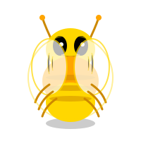

# ⚔️ Bug Monsters

[English](README.md) | 日本語

> バグとエラーをモンスターとして可視化！コードを修正してモンスターを倒そう。

Bug Monsters は、診断情報（エラー、警告、ヒント）をアニメーション付きモンスターとして可視化することで、デバッグをゲーム化する VS Code 拡張機能です。バグを修正してモンスターを倒しましょう！

## ✨ 機能

- **🎨 アニメーション SVG モンスター**: エラータイプごとにカスタムデザインされた美しいモンスター
- **⚡ リアルタイム監視**: エラーが発生すると即座にモンスターが出現
- **⚔️ 討伐アニメーション**: バグを修正すると満足感のあるアニメーション
- **📊 ライブ統計**: エラー、警告、討伐数をトラッキング
- **🎮 サイズ進化**: エラーが増えるとモンスターが大きく、より恐ろしく成長
- **🎯 クリックでナビゲート**: モンスターをクリックしてエラー箇所にジャンプ
- **🏟️ バトルフィールドレイアウト**: すべてのモンスターが重なり合える共有バトルフィールドに出現
- **👹 XL バリエーション**: 10個以上のエラーには特別に怖い SVG デザイン

## 👾 モンスタータイプ

エラータイプごとにユニークなデザインとアニメーションを持つモンスターが出現します：

### Error Monster 🔴
**発生条件：** 一般的なエラー
**説明：** 牙と爪を持つ攻撃的な赤いクリーチャー


### TypeError Beast 💜
**発生条件：** 型エラー
**説明：** 角を持つ大きな紫の獣


### ReferenceError Wraith 🔵
**発生条件：** 参照エラー
**説明：** 半透明の青い幽霊


### Warning Bug 🟡
**発生条件：** 警告
**説明：** 小さな黄色の羽虫


### Hint Spirit 🟢
**発生条件：** ヒント
**説明：** 友好的な緑の光る精霊


## 📐 モンスターサイズ

エラー数に応じてモンスターが成長します：

- **S サイズ**: 1〜2個のエラー（90px、標準デザイン）
- **M サイズ**: 3〜5個のエラー（130px、標準デザイン）
- **L サイズ**: 6〜9個のエラー（170px、標準デザイン）
- **XL サイズ**: 10個以上のエラー（210px、**より多くのトゲ、牙、エフェクトを持つ特別に怖いバリエーション**！）

### XL バリエーション - 特別に恐ろしい！ 👹

10個以上のエラーがあると、モンスターは恐ろしいXL形態に変身します：

<table>
<tr>
<td align="center">
<br/>
<b>XL Error Monster</b>
</td>
<td align="center">
<br/>
<b>XL TypeError Beast</b>
</td>
</tr>
<tr>
<td align="center">
<br/>
<b>XL ReferenceError Wraith</b>
</td>
<td align="center">
<br/>
<b>XL Warning Bug</b>
</td>
</tr>
</table>

## 🚀 はじめに

### インストール

1. VS Code を開く
2. 拡張機能パネルを開く（Ctrl+Shift+X / Cmd+Shift+X）
3. 「Bug Monsters」を検索
4. インストールをクリック

### 使い方

1. **モンスターが自動出現**: コードにエラーや警告があると、ステータスバーにモンスターが表示されます
2. **バトルフィールドを開く**: ステータスバーの剣アイコン（⚔️）をクリックして全モンスターを表示
3. **エラー箇所へ移動**: モンスターをクリックするとコード内のエラー箇所にジャンプします
4. **モンスターを倒す**: バグを修正すると満足感のある討伐アニメーションが再生されます！
5. **成長を見守る**: エラーが増えるほど、モンスターは大きく恐ろしく成長します

## 🎮 コマンド

コマンドパレット（`Ctrl/Cmd+Shift+P`）から実行：

- `Bug Monsters: Toggle Enable/Disable` - 拡張機能の有効/無効を切り替え
- `Bug Monsters: Open Monster Panel` - バトルフィールド上のすべてのモンスターを表示

## ⚙️ 設定

VS Code の設定でカスタマイズ可能：

```json
{
  // 拡張機能の有効/無効
  "bugMonsters.enable": true,

  // 同時に表示する最大モンスター数
  "bugMonsters.maxMonsters": 5,

  // 警告でもモンスターを表示
  "bugMonsters.showOnWarnings": true,

  // アニメーション速度（slow/normal/fast）
  "bugMonsters.animationSpeed": "normal",

  // モンスターテーマ（fantasy/cyber/cute）
  "bugMonsters.monsterTheme": "fantasy"
}
```

## 🎨 モンスターアニメーション & バトルフィールド

### バトルフィールドレイアウト

モンスターは共有バトルフィールド空間に出現します：
- **ダークな雰囲気の背景** グラデーションエフェクト付き
- **絶対配置**: モンスターが重なり合い、自由に移動
- **10個の定義済み位置** バトルフィールド全体に分散配置
- **半透明カード** バックドロップブラーで奥行き感
- **600px最小高さ** 壮大なバトル用

### アニメーション

各モンスターには洗練された SVG アニメーションが実装されています：

- **待機呼吸**: 微細な呼吸アニメーション
- **怒りの震え**: エラーモンスターが激しく震える
- **浮遊**: 穏やかな上下運動
- **出現爆発**: 出現時のドラマティックなエフェクト
- **討伐フェード**: バグ修正時の壮大な720°回転退場
- **成長パワーアップ**: エラー増加時のフラッシュと成長
- **XL 特殊エフェクト**: 10個以上のエラーには追加のトゲ、牙、爪、エネルギー火花

## 🤝 コントリビューション

コントリビューション歓迎！以下のようなアイデアがあります：

- [ ] さらなるモンスターデザインの追加
- [ ] サウンドエフェクトの実装
- [ ] 日次/週次討伐レポートの作成
- [ ] アチーブメントシステムの追加
- [ ] より多くの診断タイプへの対応
- [ ] カスタムモンスターテーマ

## 📜 ライセンス

MIT License

## 🎉 クレジット

開発者のデバッグ体験をより楽しく、魅力的にするために作成されました。バグ修正は壮大な戦いであるべきです！

---

**ハッピーモンスターハンティング！** ⚔️👾

*デバッグを冒険に変えたい開発者のために ❤️ を込めて作成*
