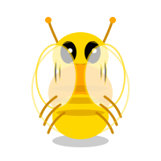

# ⚔️ Bug Monsters

English | [日本語](README.ja.md)

> Transform your debugging experience! Watch as your bugs and errors manifest as animated monsters that you must defeat by fixing your code.

Bug Monsters is a VS Code extension that gamifies the debugging process by visualizing diagnostics (errors, warnings, and hints) as animated monster creatures. Fix your bugs to defeat the monsters!

## ✨ Features

- **🎨 Animated SVG Monsters**: Beautiful, custom-designed monsters for each error type
- **⚡ Real-time Monitoring**: Instantly spawns monsters when errors appear
- **⚔️ Defeat Animations**: Satisfying animations when you fix bugs
- **📊 Live Statistics**: Track errors, warnings, and defeated monsters
- **🎮 Size Progression**: Monsters grow larger and scarier as errors accumulate
- **🎯 Click to Navigate**: Click any monster to jump to the error in your code
- **🏟️ Battlefield Layout**: All monsters appear in a shared battlefield space where they can overlap
- **👹 XL Variants**: Special scary SVG designs for monsters with 10+ issues

## 👾 Monster Types

Each error type spawns a unique monster with its own design and animations:

### Error Monster 🔴
**Triggers on:** General errors
**Description:** Aggressive red creature with fangs and claws


### TypeError Beast 💜
**Triggers on:** Type errors
**Description:** Large purple beast with horns


### ReferenceError Wraith 🔵
**Triggers on:** Reference errors
**Description:** Ghostly blue semi-transparent wraith


### Warning Bug 🟡
**Triggers on:** Warnings
**Description:** Small yellow buzzing bug



### Hint Spirit 🟢
**Triggers on:** Hints
**Description:** Friendly green glowing spirit


## 🚀 Getting Started

### Installation

1. Open VS Code
2. Go to Extensions (Ctrl+Shift+X / Cmd+Shift+X)
3. Search for "Bug Monsters"
4. Click Install

### How to Use

1. **Monsters Spawn Automatically**: When you have errors or warnings in your code, monsters will appear in the status bar
2. **Open the Battlefield**: Click the sword icon (⚔️) in the status bar to view all monsters
3. **Navigate to Errors**: Click on any monster to jump to the error location in your code
4. **Defeat Monsters**: Fix your bugs to see the satisfying defeat animation!
5. **Watch Them Grow**: The more errors you have, the bigger and scarier the monsters become

## 🎮 Commands

Access these via the Command Palette (`Ctrl/Cmd+Shift+P`):

- `Bug Monsters: Toggle Enable/Disable` - Turn the extension on/off
- `Bug Monsters: Open Monster Panel` - View all active monsters on the battlefield

## ⚙️ Configuration

Customize Bug Monsters in your VS Code settings:

```json
{
  // Enable or disable the extension
  "bugMonsters.enable": true,

  // Maximum number of monsters to display simultaneously
  "bugMonsters.maxMonsters": 5,

  // Show monsters for warnings
  "bugMonsters.showOnWarnings": true,

  // Animation speed (slow/normal/fast)
  "bugMonsters.animationSpeed": "normal",

  // Visual theme (fantasy/cyber/cute)
  "bugMonsters.monsterTheme": "fantasy"
}
```

## 🎨 Monster Animations & Battlefield

### Battlefield Layout

Monsters appear in a shared battlefield space:
- **Dark atmospheric background** with gradient effects
- **Absolute positioning**: Monsters can overlap and move freely
- **10 predefined positions** distributed across the battlefield
- **Semi-transparent cards** with backdrop blur for depth
- **600px minimum height** for epic battles

### Animations

Each monster features sophisticated SVG animations:

- **Idle Breathing**: Subtle breathing animation
- **Angry Shake**: Error monsters shake aggressively
- **Floating**: Gentle up-and-down movement
- **Spawn Explosion**: Dramatic entrance when appearing
- **Defeat Fade**: Spectacular 720° rotation exit when bugs are fixed
- **Growing Power-Up**: Flash and grow when errors increase
- **XL Special Effects**: Extra spikes, fangs, claws, and energy crackling for 10+ issues

## 🤝 Contributing

Contributions are welcome! Here are some ideas:

- [ ] Add more monster designs
- [ ] Implement sound effects
- [ ] Create daily/weekly defeat reports
- [ ] Add achievement system
- [ ] Support for more diagnostic types
- [ ] Custom monster themes

## 📜 License

MIT License - See LICENSE file for details

## 🎉 Credits

Created to make debugging more engaging and fun. Because fixing bugs should feel like an epic battle!

---

**Happy Monster Hunting!** ⚔️👾

*Made with ❤️ for developers who want to turn debugging into an adventure*
